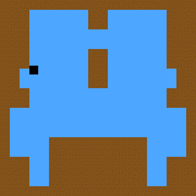

# Boosting Platforming

## Gameplay

> _(Gameplay from C++ version.)_

## Download and/or play
* [Download C++ Version](https://github.com/Camto/Boosting-Platforming/releases)
* [Play ActionScript version](https://camto.github.io/Boosting-Platforming/)
* [Download ActionScript Version](https://github.com/Camto/Boosting-Platforming/raw/master/Boosting%20Platforming.swf)

> **WARNING:** The description of boosting platforming under here is for the ActionScript version. For the description of the mechanics of the C++ version are to be found, uncommented in the C++ source code.

# Platforming Mechanics
## Boosts:
A 'boost' is a sudden burst of speed in any given direction.

* **Jump boost** _(up)_: Upward speed that, with gravity, makes the player jump five times his height.
* **Pound boost** _(down)_: Makes your downward speed maximum.
* **Dash boost** _(left or right)_: Takes full control over the player. Gradually speeds up in the selected direction, no gravity. Lasts until **Dashing** is _0_.
## Player states:
* **Surface**: The surface the player is currently on. Can be _ground_, _air_, _left wall_, or _right wall_.
* **Boosts**: How many boosts the player has left. Is a number between _0_ and _2_.
* **Boosting**: If the player is dashing or pounding. Set to _0_ if the player is not dashing, is set to greater than _0_ is the player is and acts like a timer. Set to _-1_ if pounding.
## _(psuedo)_ Code:
<pre>
If <b>Boosting</b> is <i>0</i> <i>(<b>not</b> dashing)</i>:
	If <b>Boosting</b> is <b>not</b> <i>-1</i> <i>(<b>not</b> pounding)</i>:
		If <b>Surface</b> is <b>not</b> <i>left wall</i> <b>and</b> <b>Surface</b> is <b>not</b> <i>right wall</i> <i>(<b>not</b> on a wall)</i>:
			If <b>Surface</b> is <i>ground</i> <i>(standing)</i>:
				If holding left:
					Change speed to left.
				If holding right:
					Change speed to right.
				Apply friction.
				Move horizontally.
				If pressed up <b>and</b> <b>Boosts</b> is <b>more than</b> <i>0</i> <i>(jump boosting)</i>:
					Set speed to up.
					Decrease <b>Boosts</b> by <i>1</i>.
			Else <i>(in the air)</i>:
				If holding left:
					Change speed to left.
				If holding right:
					Change speed to right.
				Apply friction.
				Move horizontally.
				Apply gravity.
				Move vertically.
				If pressed left <b>and</b> <b>Boosts</b> is <b>more than</b> <i>0</i> <i>(dash boosting to the left)</i>:
					Set speed to left.
					Set <b>Boosting</b> to <i>15</i>.
					Decrease <b>Boosts</b> by <i>1</i>.
				If pressed right <b>and</b> <b>Boosts</b> is <b>more than</b> <i>0</i> <i>(dash boosting to the right)</i>:
					Set speed to right.
					Set <b>Boosting</b> to <i>15</i>.
					Decrease <b>Boosts</b> by <i>1</i>.
				If pressed up <b>and</b> <b>Boosts</b> is <b>more than</b> <i>0</i> <i>(jump boosting)</i>:
					Set speed to up.
					Decrease <b>Boosts</b> by <i>1</i>.
				If pressed down <b>and</b> <b>Boosts</b> is <b>more than</b> <i>0</i> <i>(pound boosting)</i>:
					Set speed to down.
					Set <b>Boosting</b> to <i>-1</i>.
					Decrease <b>Boosts</b> by <i>1</i>.
		Else <i>(on a wall)</i>:
			If <b>Surface</b> is <i>left wall</i> <i>(on a left wall)</i>:
				If pressed right:
					Set speed to right.
				If pressed up <b>and</b> holding left <b>or</b> pressed left:
					Set speed to right.
					Set speed to up.
			Else <i>(on a right wall)</i>:
				If pressed left:
					Set speed to left.
				If pressed up <b>and</b> holding right <b>or</b> pressed right:
					Set speed to left.
					Set speed to up.
	Else <i>(pounding)</i>:
		Move vertically.
Else <i>(dashing)</i>:
	If <b>Boosting</b> is <b>more than</b> <i>7</i> <i>(speeding up)</i>:
		Disapply friction.
	Else <i>(slowing down)</i>:
		Apply friction.
	Move horizontally.
	Decrease <b>Boosting</b> by <i>1</i>.
</pre>